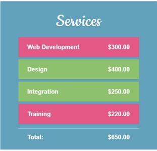
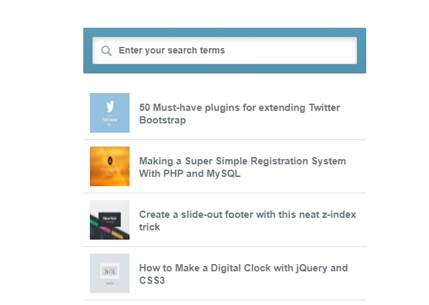

# Assignment 4 
### 1. Order Form
Build an order form with a total price updated in real time, using one of Angular's useful features - filters. Filters let you modify models and can be chained together using the pipe character |. Use the currency filter, to turn a number into a properly formatted price, complete with a dollar sign and cents. We select an item by clicking on it. As you click the background color should become green, indicating that it has been selected and the total price is updated at the same time.

[html page](./q1.html)

### 2. Instant Search

[html page](./q2.html)